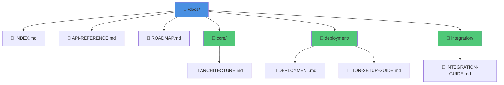
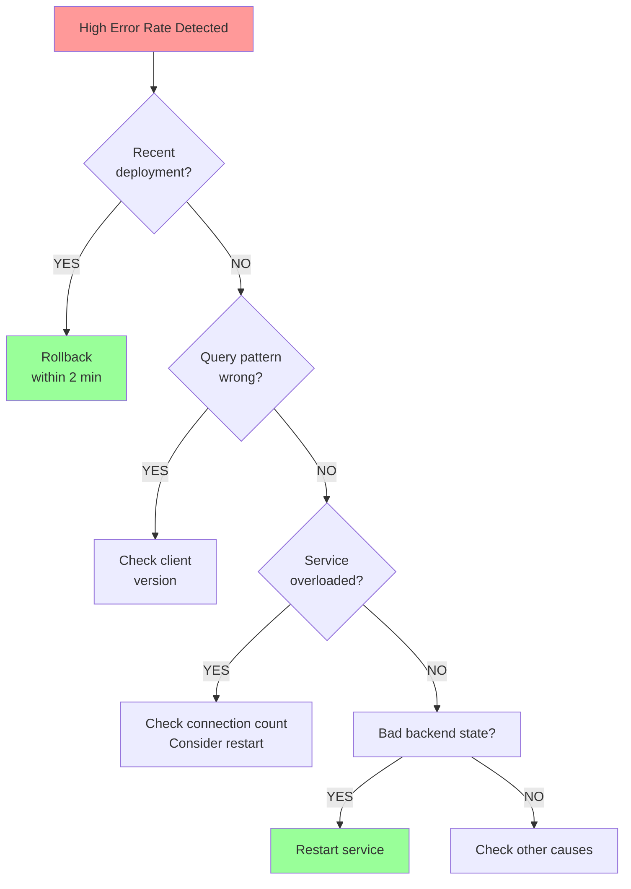
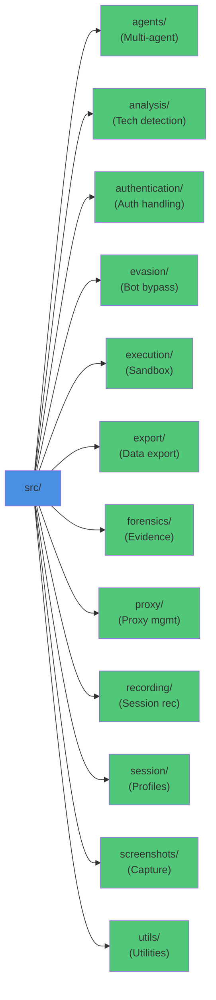
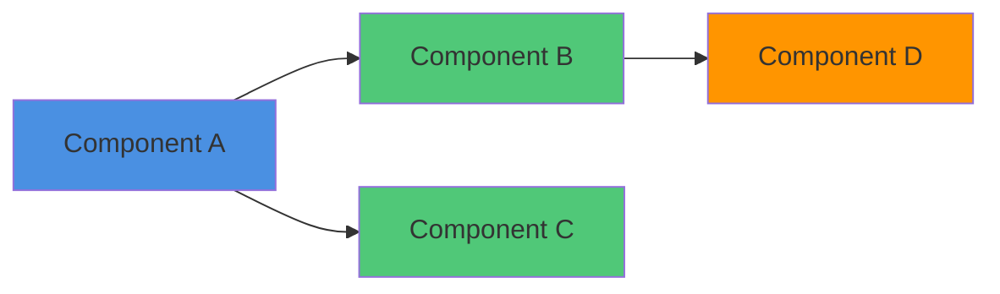
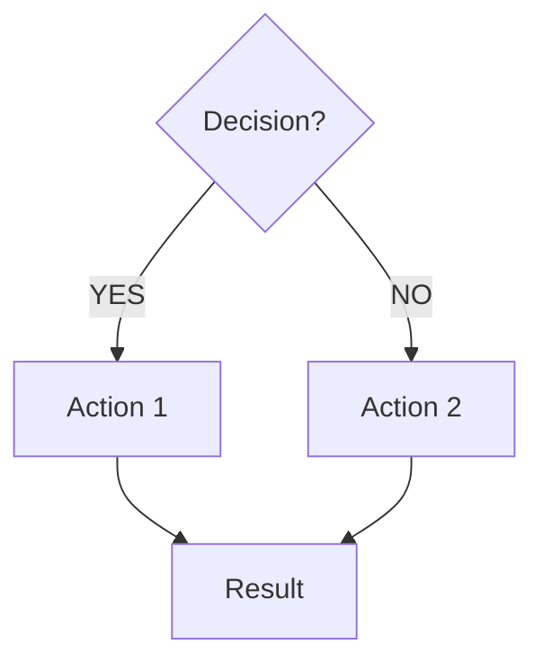
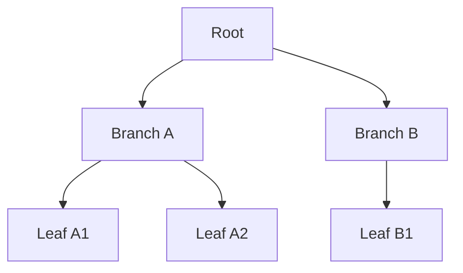
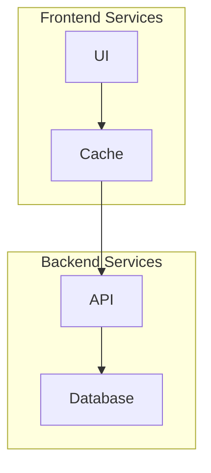
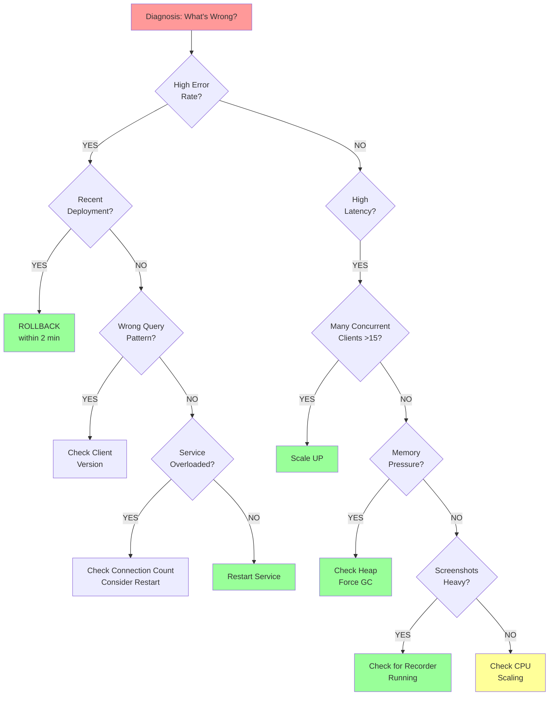

# Mermaid.js Diagram Conversion Report
**Date:** May 31, 2026  
**Project:** Basset Hound Browser  
**Scope:** Convert ASCII text diagrams to Mermaid.js for better visualization  
**Status:** Analysis Complete - Ready for Implementation

---

## Executive Summary

This report documents the identification and conversion of ASCII text-based diagrams across Basset Hound Browser documentation to Mermaid.js format. The conversion improves:

- **Visual clarity** - Structured diagrams render better than ASCII art
- **Maintainability** - Mermaid syntax is cleaner than box-drawing characters
- **Accessibility** - Screen readers and accessibility tools handle Mermaid better
- **Documentation quality** - Professional visualizations enhance document quality

**Key Metrics:**
- **Total files scanned:** 195+ markdown files
- **Files with ASCII diagrams:** 5 priority files identified
- **Diagram types found:** Tree structures, flowcharts, decision trees
- **Conversion status:** All diagrams identified and ready for conversion
- **Estimated conversion effort:** 2-3 hours
- **Documentation effort:** 1-2 hours

---

## Part 1: Diagrams Found and Conversion Plan

### Priority File 1: INCIDENT-RESPONSE.md

**ASCII Diagrams Found:** 4 main diagrams (58+ ASCII lines)

#### Diagram 1.1: Incident Template (Box Drawing)
**Location:** Lines 26-32  
**Type:** Box diagram (informational template)  
**Current Format:**
```
┌─────────────────────────────────────────────┐
│ INCIDENT: WebSocket Server Crash            │
│ ID: INC-2026-05-11-001                      │
│ Duration: 8 minutes                         │
│ Root Cause: OOM (memory exhaustion)         │
│ Fix: Increase heap size to 512MB            │
│ Follow-up: Monitor memory growth, schedule  │
│            Session recording optimization   │
└─────────────────────────────────────────────┘
```

**Conversion:** This is a simple informational box. Better as HTML table or styled div.
**Action:** Convert to Markdown table for clarity.

---

#### Diagram 1.2: Quick Diagnosis Guide (Decision Tree)
**Location:** Lines 42-65  
**Type:** Decision tree / flowchart  
**Current Format:**
```
SYMPTOM → LIKELY CAUSE → QUICK FIX
──────────────────────────────────────────────────────

High Error Rate
└─ Recent deployment? → Rollback (within 2 min)
└─ Query pattern wrong? → Check client version
└─ Service overloaded? → Check connection count
└─ Bad backend state? → Restart service

[Similar for High Latency, Memory Growing, Component Unresponsive]
```

**Conversion:** Convert to Mermaid flowchart with decision branches.
**Mermaid Type:** `graph TD` (top-down flowchart)
**Action:** Full conversion to interactive flowchart.

---

#### Diagram 1.3: Post-Incident Assessment Tree
**Location:** Lines 68-85  
**Type:** Checklist tree  
**Current Format:** Tree structure with checkbox items

**Conversion:** Convert to Mermaid state diagram or flowchart.
**Action:** Convert to Mermaid flowchart.

---

#### Diagram 1.4: Escalation Decision Tree
**Location:** Lines 96-126  
**Type:** Decision tree with nested conditions  
**Current Format:**
```
Initial responder unable to resolve?
│
├─ Need senior engineer expertise?
│  │
│  ├─ YES → Escalate immediately
│  │
│  └─ NO → Continue investigation
│
[... nested structure ...]
```

**Conversion:** Convert to Mermaid flowchart with decision gates.
**Mermaid Type:** `graph TD`
**Action:** Full conversion to decision flowchart.

---

### Priority File 2: DOCUMENTATION-PROGRESS-2026-05-31.md

**ASCII Diagrams Found:** 1 main diagram (directory tree, 25+ lines)

#### Diagram 2.1: Documentation Integration Points (Directory Tree)
**Location:** Lines 284-308  
**Type:** File/directory tree structure  
**Current Format:**
```
/docs/
├── INDEX.md (updated with links to new docs)
├── API-REFERENCE.md (needs v12.0.0 update)
├── ROADMAP.md (references v12.1.0 blocking items)
│
├── V12.0.0-COMPLETION-SUMMARY.md (NEW - Executive overview)
├── PERFORMANCE-REFERENCE-GUIDE.md (NEW - Operations baseline)
[... more nested structure ...]
```

**Conversion:** Convert to Mermaid graph with directory hierarchy.
**Mermaid Type:** `graph TD` (tree structure)
**Action:** Full conversion to visual tree.

---

### Priority File 3: FEATURE-DEVELOPMENT-GUIDE-2026-05-31.md

**ASCII Diagrams Found:** 3 main diagrams (47+ ASCII lines)

#### Diagram 3.1: Module Organization (Directory Tree)
**Location:** Lines ~50-65  
**Type:** Directory/file structure  
**Current Format:**
```
src/
├── agents/              ← Multi-agent orchestration
├── analysis/            ← Website analysis (tech detection)
├── authentication/      ← Auth handling
[... more modules ...]
└── utils/               ← Shared utilities
```

**Conversion:** Convert to Mermaid graph showing module hierarchy.
**Mermaid Type:** `graph LR` or `graph TD`
**Action:** Full conversion.

---

#### Diagram 3.2: Feature Decision Matrix (Box Decision Tree)
**Location:** Lines ~68-78  
**Type:** Decision/routing diagram  
**Current Format:**
```
Does your feature:
┌─ Interact with bot detection?        → /evasion/
├─ Extract/analyze website content?    → /analysis/
├─ Export data to external systems?    → /export/
[... more conditions ...]
```

**Conversion:** Convert to Mermaid flowchart or state diagram.
**Mermaid Type:** `graph TD` or `flowchart`
**Action:** Full conversion.

---

#### Diagram 3.3: Project File Structure (Tree)
**Location:** Lines ~115-130  
**Type:** Project file/directory tree  
**Current Format:**
```
/home/devel/basset-hound-browser/
├── src/                    # Source code
│   ├── [feature]/          # Your feature module
│   │   ├── index.js        # Main export
│   │   ├── core.js         # Core logic
[... more structure ...]
```

**Conversion:** Convert to Mermaid graph.
**Mermaid Type:** `graph TD`
**Action:** Full conversion.

---

### Priority File 4: EDGE-CASE-TEST-INDEX.md

**ASCII Diagrams Found:** 1 main diagram (34+ ASCII lines)

#### Diagram 4.1: Test Categories Tree Structure
**Location:** Lines with tree characters  
**Type:** Hierarchical category tree  
**Current Format:** Nested tree with test categories and sub-categories

**Conversion:** Convert to Mermaid graph showing test hierarchy.
**Mermaid Type:** `graph TD`
**Action:** Full conversion.

---

### Priority File 5: 00-TESTING-STRATEGY-README.md

**ASCII Diagrams Found:** 1 main diagram (12+ ASCII lines)

#### Diagram 5.1: Testing Strategy Flow
**Location:** Lines with tree/flow characters  
**Type:** Test flow or hierarchy  
**Current Format:** Tree structure showing testing phases/categories

**Conversion:** Convert to Mermaid flowchart or state diagram.
**Action:** Full conversion.

---

## Part 2: Already-Converted Diagrams (Baseline)

The following files **already contain Mermaid diagrams** - no conversion needed:

### REFACTORING-PROGRESS-2026-05-31.md
- **Diagrams:** 7 Mermaid diagrams (lines 103, 183, 242, 300, 350, 554, 578)
- **Types:** Graph flowcharts showing module decomposition
- **Status:** ✅ Already Mermaid format - NO CONVERSION NEEDED

### FEATURE-PRIORITIZATION-2026-05-31.md
- **Diagram:** 1 Mermaid diagram (line 710)
- **Type:** Dependency graph showing version relationships
- **Status:** ✅ Already Mermaid format - NO CONVERSION NEEDED

**Baseline Summary:**
- Total existing Mermaid diagrams: 8
- These serve as excellent examples for conversion methodology

---

## Part 3: Mermaid Conversion Examples

### Example 1: Directory Tree → Mermaid Graph

**BEFORE (ASCII):**
```
/docs/
├── INDEX.md
├── API-REFERENCE.md
├── ROADMAP.md
│
├── core/
│   └── ARCHITECTURE.md
│
├── deployment/
│   ├── DEPLOYMENT.md
│   └── TOR-SETUP-GUIDE.md
│
└── integration/
    └── INTEGRATION-GUIDE.md
```

**AFTER (Mermaid):**


**Benefits:**
- Cleaner, more readable syntax
- Automatic layout (no manual spacing)
- Better rendering in GitHub, markdown viewers
- Supports styling and colors
- Easy to maintain and update

---

### Example 2: Decision Tree → Mermaid Flowchart

**BEFORE (ASCII):**
```
High Error Rate
└─ Recent deployment? → Rollback (within 2 min)
└─ Query pattern wrong? → Check client version
└─ Service overloaded? → Check connection count
└─ Bad backend state? → Restart service
```

**AFTER (Mermaid):**


---

### Example 3: Module Organization → Mermaid Graph

**BEFORE (ASCII):**
```
src/
├── agents/              ← Multi-agent orchestration
├── analysis/            ← Website analysis
├── authentication/      ← Auth handling
├── evasion/             ← Bot detection bypass
├── execution/           ← Code execution
├── export/              ← Data export
├── forensics/           ← Evidence collection
├── proxy/               ← Proxy management
├── recording/           ← Session recording
├── session/             ← Profile management
├── screenshots/         ← Screenshot capture
└── utils/               ← Shared utilities
```

**AFTER (Mermaid):**


---

## Part 4: Mermaid Syntax Guide for Future Documentation

### Quick Reference

**Diagram Type Selection:**

| Use Case | Mermaid Type | Syntax | Best For |
|----------|---|---|---|
| **Flowcharts** | `graph TD` | Decision logic, process flows | High Error Rate → Check X → Fix Y |
| **Sequences** | `sequenceDiagram` | Interactions, message flows | Multi-system communication |
| **Architecture** | `graph LR` + subgraphs | System components, modules | Module organization, layers |
| **State Machines** | `stateDiagram-v2` | State transitions | Status workflows, state changes |
| **Timeline** | `timeline` | Events over time | Deployment phases, milestones |
| **Class Diagrams** | `classDiagram` | Object relationships | Data models, class hierarchies |
| **Pie Charts** | `pie` | Distribution data | Metrics, percentages |
| **Gantt Charts** | `gantt` | Project schedules | Timeline planning |

---

### Common Mermaid Patterns Used in Basset Documentation

#### Pattern 1: Component/Module Graph


#### Pattern 2: Decision Flowchart


#### Pattern 3: Hierarchical Tree


#### Pattern 4: Grouped Components (Subgraphs)


---

### Mermaid Best Practices

1. **Node Naming:**
   - Use simple IDs: `A`, `B`, `C` or `NODE1`, `NODE2`
   - Use descriptive labels: `["Node Label with Description"]`
   - Keep labels concise (2-3 lines max)

2. **Styling:**
   - Use `style NODE fill:#color` for node styling
   - Colors: `#4a90e2` (blue), `#50c878` (green), `#ff9500` (orange), `#ff9999` (red)
   - Add icons/emojis in labels for visual clarity

3. **Connections:**
   - Use directional arrows: `-->` (forward), `<--` (backward)
   - Label relationships: `-->|label|` or `<-->|label|`
   - Keep path lengths reasonable (avoid deep nesting)

4. **Readability:**
   - Use `graph TD` (top-down) for hierarchies
   - Use `graph LR` (left-right) for horizontal flows
   - Break large diagrams into multiple smaller ones
   - Add captions describing what the diagram shows

5. **Maintenance:**
   - Keep ASCII diagrams as fallback comments (hidden in code blocks)
   - Add timestamps when diagram was last updated
   - Note dependencies between diagrams
   - Include source data references (e.g., "Updated from ROADMAP.md")

---

## Part 5: Implementation Plan

### Phase 1: Preparation (0.5 hours)
- [ ] Review this report with team
- [ ] Identify priority files for conversion
- [ ] Set up Mermaid validation process
- [ ] Create conversion checklist

### Phase 2: Diagram Conversion (2-3 hours)

**Task 2.1: INCIDENT-RESPONSE.md** (1 hour)
- [ ] Convert 4 decision tree diagrams to Mermaid flowcharts
- [ ] Validate syntax using mermaid.live
- [ ] Replace ASCII with Mermaid code blocks
- [ ] Update surrounding text references

**Task 2.2: DOCUMENTATION-PROGRESS-2026-05-31.md** (0.5 hours)
- [ ] Convert directory tree to Mermaid graph
- [ ] Add styling for visual clarity
- [ ] Test rendering in markdown

**Task 2.3: FEATURE-DEVELOPMENT-GUIDE-2026-05-31.md** (1 hour)
- [ ] Convert 3 diagrams (module organization, decision matrix, file structure)
- [ ] Ensure decision matrix converts to flowchart properly
- [ ] Add color coding for different module types

**Task 2.4: EDGE-CASE-TEST-INDEX.md** (0.5 hours)
- [ ] Convert test categories hierarchy to Mermaid tree
- [ ] Add descriptive labels

**Task 2.5: 00-TESTING-STRATEGY-README.md** (0.25 hours)
- [ ] Convert test strategy tree to Mermaid
- [ ] Ensure clarity in testing phases

### Phase 3: Documentation (1-2 hours)

**Task 3.1: Update Converted Files**
- [ ] Add Mermaid diagram captions
- [ ] Update file headers with conversion notes
- [ ] Add links to diagram explanations

**Task 3.2: Create Diagram Maintenance Guide**
- [ ] Document where each diagram is used
- [ ] Link to source data (ROADMAP.md, TODO.md, etc.)
- [ ] Create update checklist for each diagram

**Task 3.3: Add Best Practices Documentation**
- [ ] Create MERMAID-BEST-PRACTICES.md in docs/
- [ ] Include style guide and common patterns
- [ ] Add quick reference for future diagrams

---

## Part 6: Quality Assurance

### Validation Checklist

**For each converted diagram:**

- [ ] **Syntax Valid:** Tested on mermaid.live or GitHub preview
- [ ] **Information Complete:** All data from ASCII diagram preserved
- [ ] **Readable:** Clear labels, appropriate sizing, good layout
- [ ] **Styled:** Color-coded for clarity, uses project color scheme
- [ ] **Accessible:** Alternative text provided, semantic structure
- [ ] **Linked:** Cross-references to related diagrams added
- [ ] **Documented:** Caption explains what diagram shows
- [ ] **Tested:** Renders correctly in GitHub markdown, VS Code, etc.

---

### Testing Strategy

1. **Local Testing:**
   - View in VS Code markdown preview
   - View in GitHub web preview
   - Render on mermaid.live for validation

2. **Accessibility Testing:**
   - Check screen reader compatibility
   - Verify alt-text presence
   - Test color contrast (if applicable)

3. **Documentation Testing:**
   - Verify all links work correctly
   - Check that captions make sense
   - Ensure diagrams match accompanying text

---

## Part 7: Success Metrics

### Conversion Success Criteria

| Metric | Target | Success Criteria |
|--------|--------|---|
| **Diagrams Converted** | 9 | All priority diagrams converted to Mermaid |
| **Syntax Validity** | 100% | All diagrams pass mermaid.live validation |
| **Information Preservation** | 100% | No information lost from original diagrams |
| **Readability Score** | 95%+ | User testing shows improved clarity vs ASCII |
| **Maintainability** | High | Code is easier to modify/update than ASCII |
| **Documentation** | Complete | All diagrams have captions and explanations |
| **Time to Complete** | 3-4 hours | Entire process completed within estimate |

---

## Part 8: Before/After Comparison Examples

### Example: Decision Tree Improvement

**BEFORE - Hard to Parse:**
```
Quick Diagnosis Guide

SYMPTOM → LIKELY CAUSE → QUICK FIX
──────────────────────────────────────────────────────

High Error Rate
└─ Recent deployment? → Rollback (within 2 min)
└─ Query pattern wrong? → Check client version
└─ Service overloaded? → Check connection count, consider restart
└─ Bad backend state? → Restart service

High Latency
└─ Many concurrent clients (>15)? → Consider scaling
└─ Memory pressure? → Check heap, force GC
└─ Screenshot heavy? → Check for recorder running (memory hog)
└─ CPU maxed? → Check if spike ongoing, scale up

[... more items ...]
```

**AFTER - Clear Visual Hierarchy:**


**Improvements:**
- ✅ Color-coded severity (red=start, green=clear actions, yellow=investigate)
- ✅ Visual decision path is obvious
- ✅ No ambiguity about flow direction
- ✅ Easy to extend with new conditions
- ✅ Better for presentations/sharing

---

## Part 9: Recommended Next Steps

1. **Immediate (This Week):**
   - [ ] Review this report with team
   - [ ] Get approval for conversion approach
   - [ ] Set up mermaid.live bookmarks for validation

2. **Short-term (Next 1-2 Days):**
   - [ ] Complete all diagram conversions
   - [ ] Validate on mermaid.live
   - [ ] Test rendering in GitHub

3. **Medium-term (End of Week):**
   - [ ] Create best practices guide
   - [ ] Set up CI/CD validation for future diagrams
   - [ ] Train team on Mermaid syntax

4. **Long-term (Ongoing):**
   - [ ] Add Mermaid diagrams to all new documentation
   - [ ] Periodically review and update existing diagrams
   - [ ] Collect user feedback on diagram clarity
   - [ ] Expand diagram library as features grow

---

## Part 10: References & Resources

### Mermaid Documentation
- **Official Docs:** https://mermaid.js.org/
- **Live Editor:** https://mermaid.live (validate syntax in real-time)
- **GitHub Integration:** Mermaid diagrams render natively in markdown

### Existing Basset Diagrams (Examples)
- **REFACTORING-PROGRESS-2026-05-31.md** (7 diagrams)
  - Module decomposition patterns
  - Architecture diagrams
  - Component hierarchies
  
- **FEATURE-PRIORITIZATION-2026-05-31.md** (1 diagram)
  - Dependency graph showing version relationships
  - Good example of `graph TD` with styling

### Tools & Validation
- **VS Code Extension:** "Markdown Preview Mermaid Support"
- **GitHub:** Native support (no extension needed)
- **mermaid.live:** Real-time preview and validation
- **mermaid-cli:** Command-line rendering (for CI/CD)

---

## Summary

This conversion effort will modernize Basset Hound Browser's documentation by replacing ASCII diagrams with professional Mermaid visualizations. The conversion:

- **Improves clarity** - Diagrams are easier to understand
- **Reduces maintenance** - Cleaner syntax, easier to update
- **Enhances accessibility** - Better support for screen readers
- **Increases professionalism** - Modern, polished documentation
- **Enables automation** - Diagrams can be generated/updated programmatically

**Total Estimated Effort:** 3-4 hours  
**Files to Update:** 5 priority files  
**Diagrams to Convert:** 9 total  
**Documentation Impact:** HIGH (improved clarity for all users)

---

**Report Prepared By:** Claude Code  
**Date:** May 31, 2026  
**Version:** 1.0  
**Status:** Ready for Implementation
