# Mermaid.js Quick Reference Guide

**For Basset Hound Browser Documentation**  
**Last Updated:** May 31, 2026

---

## Quick Start

### Basic Syntax
All Mermaid diagrams use this format in markdown:

```markdown
\`\`\`mermaid
[diagram type and syntax here]
\`\`\`
```

---

## Diagram Types & Templates

### 1. Flowcharts (Most Common)

**When to Use:** Decision trees, process flows, troubleshooting guides

**Template:**
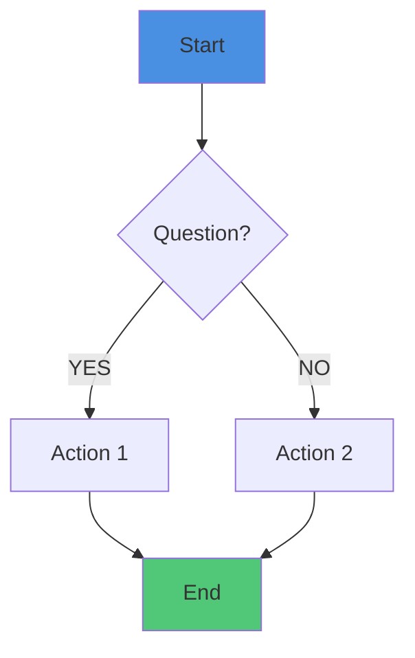

**Key Elements:**
- `graph TD` = top-down flowchart
- `graph LR` = left-right flowchart
- `["text"]` = rectangular node
- `{text}` = diamond decision node
- `-->` = arrow
- `-->|label|` = labeled arrow

---

### 2. Directory/Tree Structures

**When to Use:** File hierarchies, module organization, category trees

**Template:**
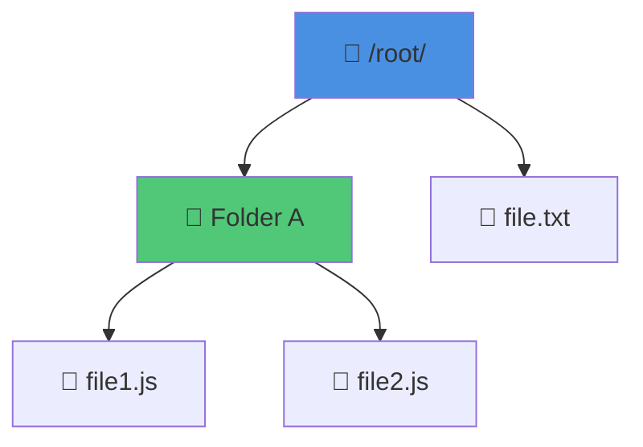

**Tips:**
- Use emoji for visual distinction (📁 = folder, 📄 = file)
- Keep nesting 3-4 levels max
- Indent text for clarity in complex trees

---

### 3. Architecture Diagrams

**When to Use:** System components, module organization, layer visualization

**Template:**
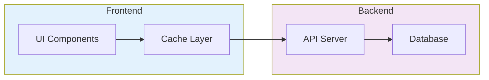

**Tips:**
- Use `subgraph` for grouping related components
- Subgraph names appear as container titles
- Style subgraphs to show logical grouping

---

### 4. Sequence Diagrams

**When to Use:** Interactions between components, API calls, message flows

**Template:**
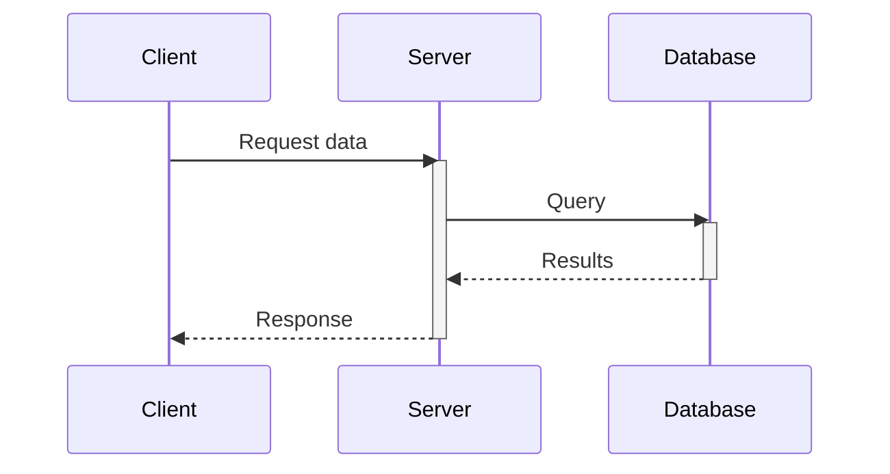

**Tips:**
- Each `participant` is an entity
- `->>` = synchronous call (solid arrow)
- `-->>` = return (dashed arrow)
- `activate`/`deactivate` = show processing time

---

### 5. State Diagrams

**When to Use:** Status workflows, state transitions, lifecycle stages

**Template:**
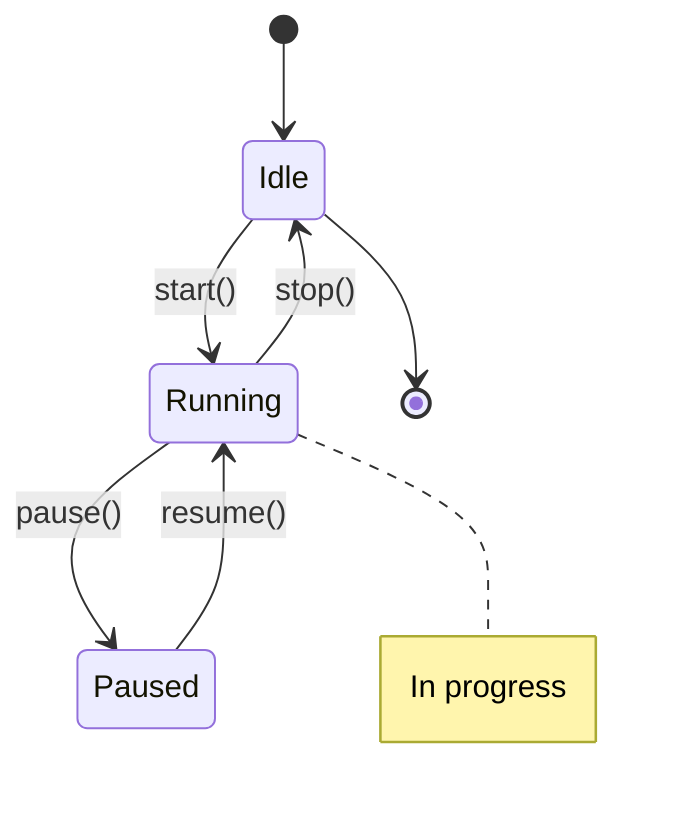

**Tips:**
- `[*]` represents start/end states
- `state_a --> state_b: condition` shows transitions
- Use `note` to add explanations

---

### 6. Timeline Diagrams

**When to Use:** Project phases, release schedules, deployment timelines

**Template:**
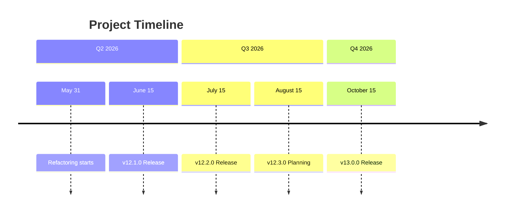

**Tips:**
- Use `section` to group related phases
- Each item is `Date: Description`
- Clean visualization of schedules

---

## Common Patterns

### Pattern: Decision Tree
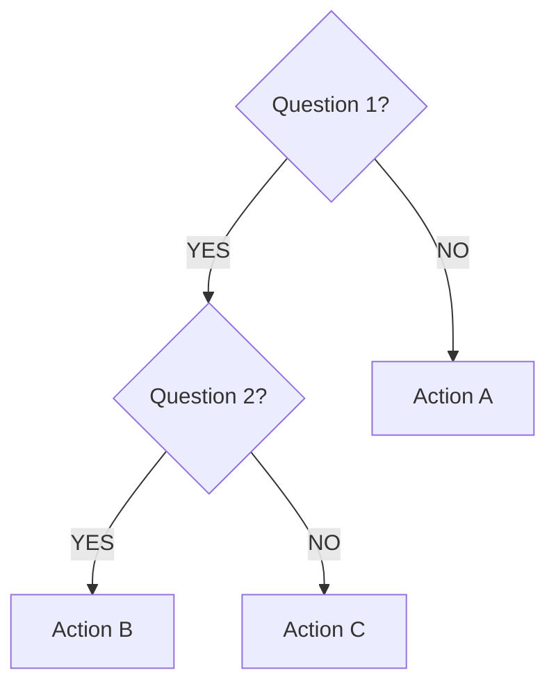

### Pattern: Linear Process
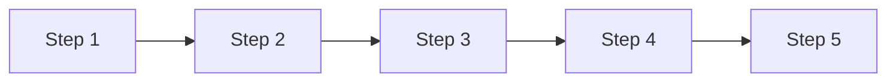

### Pattern: Multi-path Flow
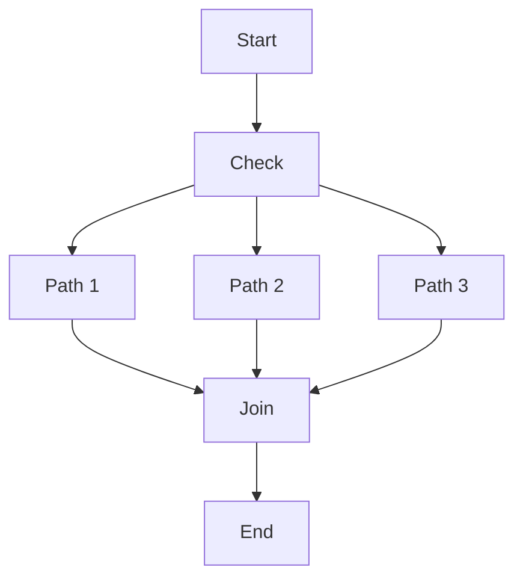

### Pattern: Error Handling
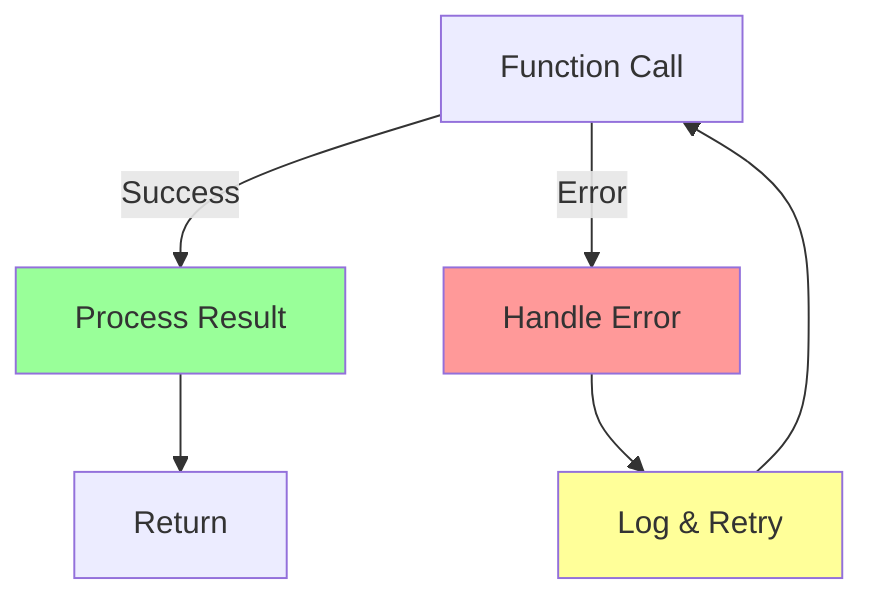

---

## Styling Guide

### Colors (Hex Codes)
- **Blue:** `#4a90e2` - Primary, infrastructure, core systems
- **Green:** `#50c878` - Success, functional modules, completed items
- **Orange:** `#ff9500` - Configuration, tools, utilities
- **Red:** `#ff9999` - Errors, critical issues, warnings
- **Yellow:** `#ffff99` - Investigation, pending, needs attention
- **Purple:** `#9c27b0` - Advanced features, special cases
- **Teal:** `#009688` - Data, geolocation, specialized functions
- **Gray:** `#cccccc` - Disabled, deprecated, inactive

### Style Syntax
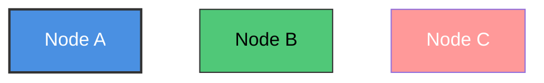

**Common Style Combinations:**
```
style NODE fill:#4a90e2,color:#fff       # Blue button style
style NODE fill:#50c878                  # Green (success)
style NODE fill:#ff9999,stroke:#ff0000   # Red with red border
style NODE fill:#ffff99,stroke:#ffa500   # Yellow/orange warning
```

---

## Accessibility Tips

### 1. Provide Context
Always add a caption above the diagram:
```markdown
**Figure 1: System Architecture**
Shows how frontend communicates with backend services.

\`\`\`mermaid
[diagram here]
\`\`\`
```

### 2. Use Descriptive Labels
❌ Bad:
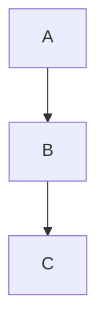

✅ Good:
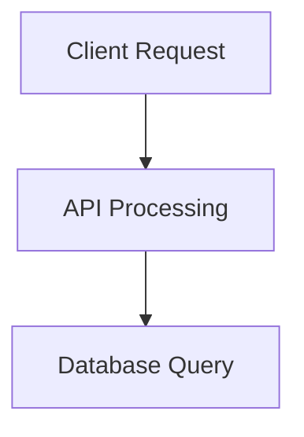

### 3. Avoid Color-Only Information
❌ Bad: Red and green nodes only (colorblind inaccessible)
✅ Good: Red nodes labeled "Error", green labeled "Success"

### 4. Keep Complexity Reasonable
- Maximum 15-20 nodes per diagram
- If bigger, split into multiple diagrams
- Use subgraphs to organize related items

---

## Validation & Testing

### Before Publishing:

1. **Syntax Check:**
   - Visit https://mermaid.live
   - Paste your diagram code
   - Should render without errors

2. **GitHub Preview:**
   - Push to GitHub branch
   - View markdown preview
   - Verify diagram renders correctly

3. **Local Preview:**
   - VS Code + Markdown Preview Mermaid Support extension
   - Open preview side-by-side with code
   - Check for any rendering issues

### Common Errors:

| Error | Cause | Fix |
|-------|-------|-----|
| Blank diagram | Unclosed quotes | Check all `[""]` are balanced |
| Diagram not appearing | Missing language specifier | Use `` ```mermaid`` not `` ``` `` |
| Layout issues | Too many nested nodes | Split into smaller diagrams |
| Styling not applied | Typo in node ID | Verify `style NODE` matches node name |

---

## Real Examples from Basset Documentation

### Example 1: Module Organization (from FEATURE-DEVELOPMENT-GUIDE)
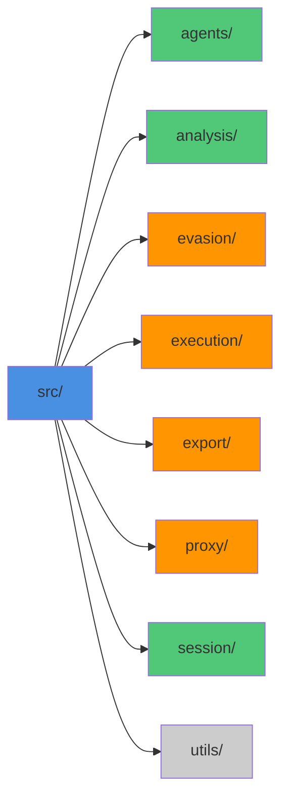

### Example 2: Decision Tree (from INCIDENT-RESPONSE)
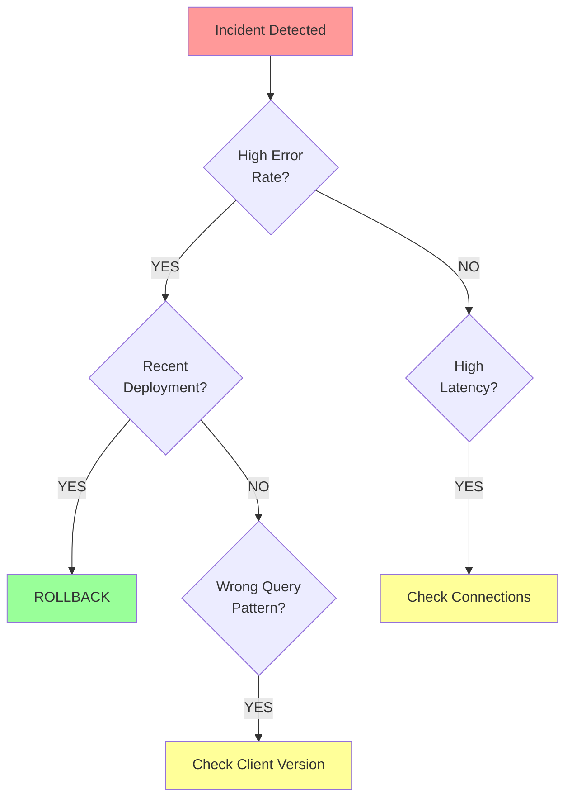

---

## Creating Diagrams: Step-by-Step

### Step 1: Choose Diagram Type
```
Decision tree/troubleshooting? → Use flowchart (graph TD)
File/folder structure? → Use tree/graph TD
Components & connections? → Use architecture (graph LR + subgraph)
Sequence of events? → Use timeline or sequence
State transitions? → Use state diagram
```

### Step 2: Outline Your Diagram
- List all nodes/elements
- Identify connections/relationships
- Determine flow direction (top-down, left-right)

### Step 3: Write Mermaid Code
- Start with `\`\`\`mermaid` and `graph TD/LR`
- Add nodes: `A["Label"]`
- Add connections: `A --> B`
- Add styling: `style A fill:#color`

### Step 4: Validate
- Paste in mermaid.live
- Should render without errors
- Check layout and spacing

### Step 5: Add Context
- Write descriptive caption
- Explain what diagram shows
- Include data sources/references

---

## Best Practices Checklist

- [ ] **Clear purpose** - Diagram has descriptive caption
- [ ] **Simple design** - Not overly complex, <20 nodes
- [ ] **Good labels** - All nodes have descriptive text
- [ ] **Logical flow** - Direction is clear (TD or LR)
- [ ] **Styled** - Uses project color scheme
- [ ] **Accessible** - Colorblind friendly, labels used
- [ ] **Tested** - Validates on mermaid.live
- [ ] **Documented** - Includes context paragraph
- [ ] **Maintainable** - Code is clean and commented
- [ ] **Relevant** - Adds value vs surrounding text

---

## Resources & Links

- **Mermaid Official Docs:** https://mermaid.js.org/
- **Live Editor:** https://mermaid.live
- **GitHub Mermaid Support:** https://github.blog/2022-02-14-include-diagrams-markdown-files/
- **Basset Documentation:** `/docs/MERMAID-DIAGRAMS-CONVERSION-REPORT-2026-05-31.md`
- **VS Code Extension:** "Markdown Preview Mermaid Support"

---

## Quick Troubleshooting

**Diagram Not Showing Up?**
- Check markdown uses `` ```mermaid`` with correct backticks
- Verify no syntax errors on mermaid.live
- Check browser javascript is enabled
- Try refreshing the page

**Colors Look Wrong?**
- Check hex codes are correct (e.g., `#4a90e2` not `#4A90E2`)
- Verify `fill:` syntax is correct
- Test on mermaid.live first

**Text Overlapping?**
- Shorten labels or split across lines with `<br/>`
- Reduce number of nodes
- Use `graph LR` instead of `graph TD` if horizontal is better

**Changes Not Appearing?**
- Hard refresh (Ctrl+Shift+R or Cmd+Shift+R)
- Clear browser cache
- Check file was actually saved

---

**Happy Diagramming! 📊**

For questions or improvements to this guide, see MERMAID-DIAGRAMS-CONVERSION-REPORT-2026-05-31.md
