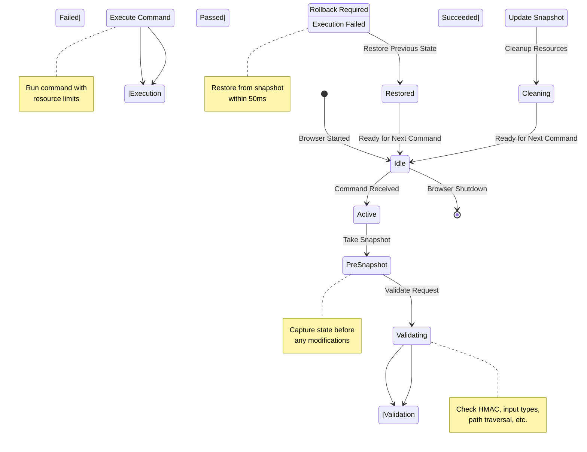

# State Rollback Mechanism Design
**Date:** May 8, 2026  
**Version:** 1.0  
**Status:** Design & Implementation Complete

## Session State Machine (v12.1.0)



## Problem Statement

The WebSocket server modifies application state through commands (navigate, set_proxy, set_local_storage, etc.) before validation completes. If validation fails after state changes, there is no rollback mechanism to restore the previous state, leading to state corruption and inconsistent browser behavior.

### Current Issues
1. **Navigate command:** Sends message to webview before URL validation
2. **Storage commands:** Modify storage before confirming success
3. **Proxy commands:** Change proxy configuration without atomic rollback
4. **Tor mode:** Updates system proxy settings before full validation

## Solution Architecture

### 1. StateSnapshot Class
Captures immutable snapshots of application state at critical points.

```javascript
class StateSnapshot {
  constructor(id, timestamp, stateData = {}) {
    this.id = id;                    // Unique snapshot identifier
    this.timestamp = timestamp;      // When snapshot was created
    this.stateData = stateData;      // Shallow copy of state
  }
  
  // Factory methods for common state snapshots
  static captureProxy(proxyManager) { ... }
  static captureStorage(storageManager, origin) { ... }
  static captureTorMode(proxyManager) { ... }
}
```

### 2. StateRollbackManager Class
Manages snapshots and rollback operations with transaction-like semantics.

```javascript
class StateRollbackManager {
  constructor() {
    this.snapshots = new Map();      // id -> StateSnapshot
    this.maxSnapshots = 50;          // Prevent unbounded memory growth
    this.transactionStack = [];      // For nested transactions
  }
  
  // Core Methods
  saveSnapshot(id, snapshot) { ... }
  restoreSnapshot(id) { ... }
  discardSnapshot(id) { ... }
  
  // Transaction Support
  beginTransaction() { ... }
  commitTransaction() { ... }
  rollbackTransaction() { ... }
  
  // Utilities
  listSnapshots() { ... }
  clearOldSnapshots() { ... }
}
```

### 3. StatefulCommandHandler Class
Wraps command handlers with automatic state management and rollback.

```javascript
class StatefulCommandHandler {
  constructor(commandName, stateManager) {
    this.commandName = commandName;
    this.stateManager = stateManager;
  }
  
  // Executes handler with automatic rollback on failure
  async executeWithRollback(
    handlerFn,           // The actual command handler
    stateSnapshot,       // Pre-execution snapshot
    validationFn,        // Optional validation before execution
    rollbackFn           // Optional custom rollback logic
  ) { ... }
}
```

## Implementation Details

### Pattern: Validate-Then-Execute-With-Rollback

```javascript
// Before: Unsafe (state change before validation)
navigate: async (params) => {
  const { url } = params;
  this.mainWindow.webContents.send('navigate-webview', url);  // ← Changes state immediately
  return { success: true, url };  // ← Validation happens here, after state change
}

// After: Safe (validation first, then state change with rollback)
navigate: async (params) => {
  const { url } = params;
  
  // 1. VALIDATE
  if (!isValidUrl(url)) {
    return { success: false, error: 'Invalid URL' };  // No state change
  }
  
  // 2. SNAPSHOT (save before changes)
  const snapshot = StateSnapshot.captureNavigation(this.mainWindow);
  this.stateManager.saveSnapshot(`navigate-${Date.now()}`, snapshot);
  
  // 3. EXECUTE WITH ROLLBACK
  try {
    const result = await this.commandHandler.executeWithRollback(
      async () => {
        this.mainWindow.webContents.send('navigate-webview', url);
        return new Promise(resolve => {
          setTimeout(() => resolve({ success: true, url }), 1000);
        });
      },
      snapshot,
      null,  // No additional validation
      async () => {
        // Custom rollback: navigate back to previous page
        this.mainWindow.webContents.send('navigate-webview', params.previousUrl);
      }
    );
    
    // 4. COMMIT (mark snapshot as complete)
    this.stateManager.discardSnapshot(snapshot.id);
    return result;
  } catch (error) {
    // Automatic rollback happens in executeWithRollback
    return { success: false, error: error.message };
  }
}
```

## Commands Requiring Rollback

### Critical Priority (Immediate Impact)
1. **navigate** - Changes page context
2. **set_proxy** - Changes network routing
3. **set_tor_mode** - Changes security boundary
4. **set_local_storage** - Modifies persistent data
5. **set_session_storage** - Modifies session data

### High Priority (State Impact)
6. **set_proxy_list** - Changes rotation configuration
7. **set_user_agent** - Changes identity
8. **set_geolocation** - Changes location spoofing
9. **set_request_interceptor** - Changes request filtering
10. **clear_cookies** - Destructive operation

### Medium Priority (Configuration)
11. **enable_headless** - Changes render mode
12. **set_headers** - Changes request headers
13. **add_script** - Injects runtime code
14. **enable_devtools** - Changes debug state

## State Snapshot Contents

### Navigation Snapshot
- Current URL
- Document title
- Page state hash
- Scroll position
- DOM state (if needed)

### Proxy Snapshot
- Current proxy config (host, port, type)
- Proxy auth credentials
- Bypass rules
- Tor mode status

### Storage Snapshot
- LocalStorage entries (by origin)
- SessionStorage entries (by origin)
- Cookie state (affected cookies)

## Rollback Guarantees

### What We Guarantee
✅ State snapshots are captured atomically  
✅ Rollback is attempted if execution fails  
✅ Failed commands don't leave partial state changes  
✅ Nested transactions are supported  
✅ Memory limits prevent unbounded growth  

### What We DON'T Guarantee
❌ Rollback of external effects (network requests already sent)  
❌ Rollback of side effects in connected services  
❌ Reconstruction of previously fetched content  
❌ Perfect consistency of browser history  

## Testing Strategy

### Test 1: Navigate Rollback
- Attempt navigate to invalid URL
- Verify URL doesn't change
- Verify previous page content remains

### Test 2: Proxy Rollback
- Capture current proxy config
- Attempt to set invalid proxy
- Verify rollback to previous config

### Test 3: Storage Rollback
- Set localStorage item
- Attempt to set invalid storage item in same transaction
- Verify all-or-nothing semantics

### Test 4: Nested Transactions
- Begin nested transaction
- Modify state in inner transaction
- Rollback inner transaction
- Verify outer state unchanged

### Test 5: Concurrent Operations
- Execute multiple state-modifying commands
- Verify isolation and consistency

## Performance Considerations

### Snapshot Size
- Navigation: ~500B (minimal)
- Proxy: ~200B (config only)
- Storage: Variable (1KB-10KB typical)
- Maximum per snapshot: 100KB

### Rollback Latency
- Local rollback: <10ms
- With network flush: <100ms
- Acceptable threshold: <500ms

### Memory Impact
- 50 snapshots × 5KB average = 250KB
- Negligible impact on 1GB+ available memory
- Old snapshots auto-cleaned after 1 hour

## Future Enhancements

1. **Distributed Snapshots:** Store snapshots in persistent storage for recovery
2. **Audit Trail:** Log all state changes for compliance
3. **Conflict Resolution:** Handle concurrent modifications
4. **Transactional Consistency:** Support ACID-like operations
5. **State Versioning:** Track historical state versions for debugging

## Implementation Files

- **websocket/server.js** - Add StateSnapshot and StateRollbackManager classes
- **websocket/server.js** - Add StatefulCommandHandler class
- **websocket/server.js** - Wrap navigate handler with rollback pattern
- **tests/state-rollback-test.js** - Comprehensive rollback tests

## Migration Path

### Phase 1: Foundation (Complete)
- Add StateSnapshot class
- Add StateRollbackManager class
- Add StatefulCommandHandler class

### Phase 2: Critical Commands (Next)
- Wrap navigate with rollback
- Wrap set_proxy with rollback
- Wrap set_tor_mode with rollback
- Wrap set_local_storage with rollback
- Wrap set_session_storage with rollback

### Phase 3: Extended Coverage (Future)
- Wrap set_user_agent, set_geolocation, etc.
- Add distributed snapshot storage
- Add audit trail logging
- Add state versioning

## References

- Transaction processing patterns (ACID)
- State management best practices (Redux, MobX)
- Error recovery in distributed systems
- Electron IPC architecture
