# Basset Hound Browser API Reference

**Version**: 12.8.0 (Production Ready)  
**Protocol**: WebSocket (JSON messages)  
**Default Port**: 8765  
**Last Updated**: June 21, 2026  
**Status**: Phase 1 Forensic Commands Complete (50 new commands)  
**Total Commands**: 140+ WebSocket commands documented  

**NOTE: This is v12.1.0 documentation. See [API-REFERENCE-V12.8.0.md](API-REFERENCE-V12.8.0.md) for latest v12.8.0 features including 50 Phase 1 forensic commands.**

## Connection Information

### WebSocket URL

```
ws://localhost:8765     # Standard connection
wss://localhost:8765    # SSL/TLS connection (if configured)
```

### Authentication

Authentication is optional by default. When enabled:

```javascript
// Via query parameter
ws://localhost:8765?token=YOUR_TOKEN

// Via header
Authorization: Bearer YOUR_TOKEN

// Via authenticate command
{ "id": 1, "command": "authenticate", "token": "YOUR_TOKEN" }
```

## Message Format

### Request

```json
{
  "id": "unique-request-id",
  "command": "command_name",
  "param1": "value1",
  "param2": "value2"
}
```

### Success Response

```json
{
  "id": "unique-request-id",
  "command": "command_name",
  "success": true,
  "data": { ... }
}
```

### Error Response

```json
{
  "id": "unique-request-id",
  "command": "command_name",
  "success": false,
  "error": "Error message",
  "recovery": { "suggestion": "...", "alternativeCommands": [...] }
}
```

## Important: Timing Requirements

**Page-dependent commands require the page to load first.**

After calling `navigate`, wait 2-4 seconds (or use `wait_for_element`) before calling:
- `get_page_state`
- `get_content`
- `execute_script`
- `screenshot`
- `click`, `fill`, `scroll`

This is standard browser automation behavior.

---

## WebSocket Command Lifecycle (v12.1.0)

```mermaid
graph LR
    A["Client Request<br/>(JSON)"] -->|1. Transmit| B["WebSocket Server"]
    B -->|2. Parse| C["Message Router"]
    C -->|3. Validate| D["Authorization<br/>& Input Validation"]
    D -->|4a. Fail| E["Error Response"]
    D -->|4b. Pass| F["Command Handler"]
    F -->|5. Execute| G["Browser Engine"]
    G -->|6. Capture| H["Response Data"]
    H -->|7. Sanitize| I["Output Cleaner<br/>(Data Protection)"]
    I -->|8. Compress| J["Response Encoder"]
    J -->|9. Send| K["Client Response<br/>(JSON)"]
    E -->|Error| K
    
    style A fill:#e1f5ff
    style K fill:#c8e6c9
    style D fill:#fff3cd
    style I fill:#f3e5f5
```



**Key Stages:**
1. **Transmission** - Client sends JSON command via WebSocket
2. **Parsing** - Server deserializes and validates JSON structure
3. **Routing** - Router identifies command type and handler
4. **Validation** - HMAC signature, input type/format, command authorization
5. **Execution** - Command handler executes in browser engine
6. **Capture** - Results collected from browser (HTML, screenshots, etc.)
7. **Sanitization** - Sensitive data removed (passwords, API keys)
8. **Compression** - Response compressed (70-93% reduction)
9. **Response** - Client receives serialized JSON result

**Performance:** <2ms P99 latency from receipt to response

---

## Command Categories

### Navigation Commands

| Command | Description | Parameters |
|---------|-------------|------------|
| `navigate` | Navigate to URL | `url` (required) |
| `get_url` | Get current URL | - |
| `get_page_state` | Get page title, URL, forms, links | - |
| `get_content` | Get HTML and text content | - |
| `wait_for_element` | Wait for element to appear | `selector`, `timeout` (default 10000ms) |
| `execute_script` | Execute JavaScript in page | `script` (required) |

### Page Interaction Commands

| Command | Description | Parameters |
|---------|-------------|------------|
| `click` | Click element by selector | `selector`, `humanize` (default true) |
| `fill` | Fill form field | `selector`, `value`, `humanize` (default true) |
| `scroll` | Scroll page or to element | `x`, `y`, `selector`, `humanize` (default true) |
| `key_press` | Press keyboard key | `key`, `modifiers`, `humanize` |
| `key_combination` | Press key combination | `keys`, `humanize` |
| `type_text` | Type text with human timing | `text`, `selector`, `humanize` |
| `mouse_move` | Move mouse to position | `x`, `y`, `humanize` |
| `mouse_click` | Click at position | `x`, `y`, `button`, `humanize` |
| `mouse_drag` | Drag from one point to another | `startX`, `startY`, `endX`, `endY` |

### Content Extraction Commands

| Command | Description | Parameters |
|---------|-------------|------------|
| `extract_metadata` | Extract meta tags, Open Graph, Twitter Cards | - |
| `extract_links` | Extract all links | `includeExternal` |
| `extract_forms` | Extract form data | - |
| `extract_images` | Extract images | `includeLazy` |
| `extract_scripts` | Extract script references | - |
| `extract_stylesheets` | Extract stylesheet references | - |
| `extract_structured_data` | Extract JSON-LD and microdata | - |
| `extract_all` | Extract all content types | - |

### Screenshot Commands

| Command | Description | Parameters |
|---------|-------------|------------|
| `screenshot` | Capture screenshot | `format` (png/jpeg) |
| `screenshot_viewport` | Capture visible viewport | `format` |
| `screenshot_full_page` | Capture entire page | `format` |
| `screenshot_element` | Capture specific element | `selector`, `format` |
| `screenshot_area` | Capture specific area | `x`, `y`, `width`, `height` |
| `annotate_screenshot` | Add annotations to screenshot | `screenshotData`, `annotations` |
| `screenshot_formats` | List supported formats | - |

### Cookie Management Commands

| Command | Description | Parameters |
|---------|-------------|------------|
| `get_cookies` | Get cookies for URL | `url` (required) |
| `get_all_cookies` | Get all cookies | `filter` |
| `set_cookie` | Set a cookie | `cookie` object |
| `set_cookies` | Set multiple cookies | `cookies` array |
| `delete_cookie` | Delete specific cookie | `url`, `name` |
| `clear_all_cookies` | Clear all cookies | `domain` (optional) |
| `export_cookies` | Export cookies | `format`, `filter` |
| `import_cookies` | Import cookies | `data`, `format` |
| `get_cookies_for_domain` | Get cookies by domain | `domain` |
| `get_cookie_stats` | Get cookie statistics | - |
| `flush_cookies` | Flush cookies to storage | - |

### Session/Tab Management Commands

| Command | Description | Parameters |
|---------|-------------|------------|
| `create_session` | Create new session | `name`, `userAgent`, `fingerprint` |
| `switch_session` | Switch to session | `sessionId` |
| `delete_session` | Delete session | `sessionId` |
| `list_sessions` | List all sessions | - |
| `get_session_info` | Get session details | `sessionId` |
| `clear_session_data` | Clear session data | `sessionId` |
| `export_session` | Export session | `sessionId` |
| `import_session` | Import session | `data` |
| `new_tab` | Open new tab | `url` |
| `close_tab` | Close tab | `tabId` |
| `switch_tab` | Switch to tab | `tabId` |
| `list_tabs` | List all tabs | - |
| `get_tab_info` | Get tab details | `tabId` |
| `get_active_tab` | Get active tab | - |
| `navigate_tab` | Navigate specific tab | `tabId`, `url` |
| `reload_tab` | Reload tab | `tabId` |

### Evidence Chain Commands

Initialize evidence chain before use with `init_evidence_chain`.

| Command | Description | Parameters |
|---------|-------------|------------|
| `init_evidence_chain` | Initialize evidence manager | `basePath`, `autoVerify`, `autoSeal` |
| `create_investigation` | Create new investigation | `name`, `description`, `investigator` |
| `collect_evidence_chain` | Collect evidence with chain of custody | `type`, `data`, `metadata`, `actor` |
| `verify_evidence_chain` | Verify evidence integrity | `evidenceId` |
| `seal_evidence_chain` | Seal evidence (make immutable) | `evidenceId`, `actor` |
| `get_evidence_chain` | Get evidence by ID | `evidenceId` |
| `list_evidence_chain` | List all evidence | `type`, `investigationId`, `sealed` |
| `create_evidence_package` | Create evidence package | `name`, `description`, `caseId` |
| `add_to_evidence_package` | Add evidence to package | `packageId`, `evidenceId` |
| `seal_evidence_package` | Seal package | `packageId`, `actor` |
| `export_evidence_package` | Export package | `packageId`, `format` |
| `get_chain_audit_log` | Get audit log | `investigationId`, `actor` |
| `collect_screenshot_chain` | Screenshot with chain of custody | `investigationId`, `actor`, `tags` |

### Evasion Commands (Bot Detection Avoidance)

#### Fingerprint Profile Commands

| Command | Description | Parameters |
|---------|-------------|------------|
| `create_fingerprint_profile` | Create fingerprint profile | `id`, `platform`, `timezone`, `tier` |
| `create_regional_fingerprint` | Create regional profile | `region` (US, UK, EU, RU, JP, CN, AU) |
| `get_fingerprint_profile` | Get profile by ID | `profileId` |
| `list_fingerprint_profiles` | List all profiles | - |
| `set_active_fingerprint` | Set active profile | `profileId` |
| `get_active_fingerprint` | Get active profile | - |
| `apply_fingerprint` | Apply fingerprint to page | `profileId` |
| `delete_fingerprint_profile` | Delete profile | `profileId` |
| `get_fingerprint_options` | Get available platforms/timezones | - |

#### Behavioral AI Commands

| Command | Description | Parameters |
|---------|-------------|------------|
| `create_behavioral_profile` | Create behavioral profile | `sessionId`, `speedMultiplier`, `accuracyLevel` |
| `generate_mouse_path` | Generate human-like mouse path | `sessionId`, `start`, `end`, `targetWidth` |
| `generate_scroll_behavior` | Generate human-like scroll | `sessionId`, `distance`, `direction` |
| `generate_typing_events` | Generate human-like typing | `sessionId`, `text` |
| `get_behavioral_profile` | Get behavioral profile | `sessionId` |
| `list_behavioral_sessions` | List behavioral sessions | - |

#### Honeypot Detection Commands

| Command | Description | Parameters |
|---------|-------------|------------|
| `check_honeypot` | Check if element is honeypot | `element` object |
| `filter_honeypots` | Filter honeypots from fields | `fields` array |

#### Rate Limit Adaptation Commands

| Command | Description | Parameters |
|---------|-------------|------------|
| `get_rate_limit_state` | Get rate limit state for domain | `domain` |
| `record_request_success` | Record successful request | `domain` |
| `record_rate_limit` | Record rate limit hit | `domain`, `retryAfter` |
| `is_rate_limited` | Check if status indicates rate limit | `statusCode` |
| `reset_rate_limit` | Reset rate limit adapter | `domain` |
| `list_rate_limit_adapters` | List all adapters | - |

### Memory Monitoring Commands

| Command | Description | Parameters |
|---------|-------------|------------|
| `get_memory_usage` | Get current memory usage | - |
| `get_memory_stats` | Get detailed memory statistics | - |
| `force_gc` | Force garbage collection | - |
| `clear_caches` | Clear browser caches | - |
| `start_memory_monitoring` | Start memory monitoring | `interval` |
| `stop_memory_monitoring` | Stop memory monitoring | - |
| `set_memory_thresholds` | Set memory alert thresholds | `warning`, `critical`, `action` |
| `get_memory_history` | Get memory usage history | `limit` |
| `check_memory` | Check memory status | - |
| `detect_memory_leaks` | Detect potential memory leaks | - |

### Utility Commands

| Command | Description | Parameters |
|---------|-------------|------------|
| `ping` | Check connection | - |
| `status` | Get browser status | - |
| `get_manager_status` | Get all manager status | - |
| `is_command_retryable` | Check if command is retryable | `command` |
| `get_recovery_config` | Get error recovery config | - |

---

## Usage Examples

### Basic Navigation with Timing

```javascript
const WebSocket = require('ws');
const ws = new WebSocket('ws://localhost:8765');

ws.on('open', () => {
  // Step 1: Navigate
  ws.send(JSON.stringify({
    id: 1,
    command: 'navigate',
    url: 'https://example.com'
  }));
});

ws.on('message', (data) => {
  const msg = JSON.parse(data);

  if (msg.id === 1 && msg.success) {
    // Step 2: Wait for page load, then get content
    setTimeout(() => {
      ws.send(JSON.stringify({
        id: 2,
        command: 'get_page_state'
      }));
    }, 3000); // Wait 3 seconds
  }

  if (msg.id === 2) {
    console.log('Page state:', msg);
  }
});
```

### Using wait_for_element Instead of setTimeout

```javascript
// Navigate
ws.send(JSON.stringify({
  id: 1,
  command: 'navigate',
  url: 'https://example.com'
}));

// Wait for specific element
ws.send(JSON.stringify({
  id: 2,
  command: 'wait_for_element',
  selector: '#main-content',
  timeout: 10000
}));

// Then interact
ws.send(JSON.stringify({
  id: 3,
  command: 'click',
  selector: '#submit-button'
}));
```

### Cookie Management

```javascript
// Get cookies
ws.send(JSON.stringify({
  id: 1,
  command: 'get_cookies',
  url: 'https://example.com'
}));

// Set cookie
ws.send(JSON.stringify({
  id: 2,
  command: 'set_cookie',
  cookie: {
    url: 'https://example.com',
    name: 'session_id',
    value: 'abc123',
    httpOnly: true,
    secure: true
  }
}));
```

### Evidence Collection

```javascript
// Initialize evidence chain
ws.send(JSON.stringify({
  id: 1,
  command: 'init_evidence_chain',
  basePath: '/tmp/evidence'
}));

// Create investigation
ws.send(JSON.stringify({
  id: 2,
  command: 'create_investigation',
  name: 'Investigation 2026-001',
  investigator: 'analyst@example.com'
}));

// Collect screenshot as evidence
ws.send(JSON.stringify({
  id: 3,
  command: 'collect_screenshot_chain',
  investigationId: 'inv_123',
  actor: 'analyst@example.com',
  tags: ['homepage', 'initial-capture']
}));

// Seal and export
ws.send(JSON.stringify({
  id: 4,
  command: 'seal_evidence_chain',
  evidenceId: 'ev_456',
  actor: 'analyst@example.com'
}));
```

### Bot Detection Evasion

```javascript
// Create fingerprint profile
ws.send(JSON.stringify({
  id: 1,
  command: 'create_fingerprint_profile',
  platform: 'windows',
  timezone: 'America/New_York',
  tier: 'high'
}));

// Create behavioral profile
ws.send(JSON.stringify({
  id: 2,
  command: 'create_behavioral_profile',
  sessionId: 'session_001',
  speedMultiplier: 1.0,
  accuracyLevel: 0.95
}));

// Generate human-like mouse movement
ws.send(JSON.stringify({
  id: 3,
  command: 'generate_mouse_path',
  sessionId: 'session_001',
  start: { x: 100, y: 100 },
  end: { x: 500, y: 300 },
  targetWidth: 50
}));

// Apply fingerprint
ws.send(JSON.stringify({
  id: 4,
  command: 'apply_fingerprint',
  profileId: 'fp_001'
}));
```

### Memory Monitoring

```javascript
// Get memory usage
ws.send(JSON.stringify({
  id: 1,
  command: 'get_memory_usage'
}));

// Start monitoring
ws.send(JSON.stringify({
  id: 2,
  command: 'start_memory_monitoring',
  interval: 5000
}));

// Set thresholds
ws.send(JSON.stringify({
  id: 3,
  command: 'set_memory_thresholds',
  warning: 500,    // MB
  critical: 750,   // MB
  action: 1000     // MB
}));
```

---

## Error Recovery

The API includes built-in error recovery suggestions. When an error occurs, check the `recovery` field:

```json
{
  "success": false,
  "error": "Element not found",
  "recovery": {
    "suggestion": "Verify the selector is correct and the page has fully loaded. Use wait_for_element before interacting.",
    "alternativeCommands": ["wait_for_element", "get_page_state"]
  }
}
```

### Retryable Commands

These commands are safe to retry on transient errors:
- `get_url`, `get_content`, `get_page_state`
- `screenshot`, `screenshot_viewport`, `screenshot_full_page`
- `get_cookies`, `get_all_cookies`
- `list_sessions`, `list_tabs`
- `status`, `ping`

---

---

## Wave 12 New Commands (v12.1.0)

### Technology Detection Commands

Detect 200+ web technologies with multi-method analysis:

| Command | Description | Parameters |
|---------|-------------|------------|
| `detect_technologies` | Detect all technologies on page | `analyze_scripts`, `analyze_headers`, `analyze_meta` (all default true) |
| `detect_technology_by_method` | Detect specific technology | `method` (wappalyzer\|headers\|meta\|scripts), `technology` (optional) |
| `get_technology_confidence` | Get confidence score for technology | `technology`, `method` |
| `analyze_javascript_frameworks` | Detect JS frameworks | - |
| `analyze_cms_detection` | Detect CMS systems | - |
| `analyze_server_headers` | Analyze HTTP headers | - |

### Forensic Evidence Export Commands

Export evidence with chain-of-custody compliance:

| Command | Description | Parameters |
|---------|-------------|------------|
| `export_evidence` | Export forensic evidence | `include_metadata`, `include_screenshots`, `format` (json\|csv) |
| `get_chain_of_custody` | Get evidence chain | `evidence_id` |
| `validate_evidence_integrity` | Validate evidence hash | `evidence_id`, `hash` |

### Platform Integration Commands

Native integrations with SIEM and logging platforms:

| Command | Description | Parameters |
|---------|-------------|------------|
| `send_to_splunk` | Send data to Splunk HEC | `sourcetype`, `source`, `host` |
| `send_to_elk` | Send to ELK Stack | `index_name`, `doc_type` |
| `send_to_webhook` | Send to custom webhook | `url`, `headers`, `format` |
| `send_to_syslog` | Send to syslog server | `host`, `port`, `facility` |
| `send_to_kafka` | Publish to Kafka topic | `topic`, `partition` |

### Priority Queue Commands

Intelligent command prioritization:

| Command | Description | Parameters |
|---------|-------------|------------|
| `set_command_priority` | Set priority for command | `command_name`, `priority` (0-100) |
| `get_priority_queue_stats` | Get queue statistics | - |
| `clear_priority_queue` | Clear all queued commands | - |

### Screenshot Processing Commands

Parallel screenshot capture and processing:

| Command | Description | Parameters |
|---------|-------------|------------|
| `screenshot_parallel` | Capture multiple screenshots | `count`, `delay_ms` |
| `screenshot_batch` | Batch screenshot capture | `batches`, `batch_size` |
| `get_screenshot_quality` | Analyze screenshot quality | - |

---

## Related Documentation

- [Integration Readiness](integration_readiness.md) - Deployment and integration status
- [OpenAPI Spec](api/openapi.yaml) - OpenAPI 3.0 specification
- [MCP Server](../mcp/README.md) - MCP protocol integration
- [v12.1.0 Features](../V12.1.0-FEATURES-INDEX-2026-05-31.md) - Complete Wave 12 feature guide
- [Technology Detection Guide](../TECHNOLOGY-DETECTION-GUIDE-2026-05-31.md) - Detecting 200+ technologies
- [Forensic Evidence Export](../FORENSIC-EVIDENCE-EXPORT-GUIDE-2026-05-31.md) - Chain-of-custody export
- [Platform Integrations](../PLATFORM-INTEGRATIONS-QUICK-START.md) - SIEM/ELK/Splunk setup
